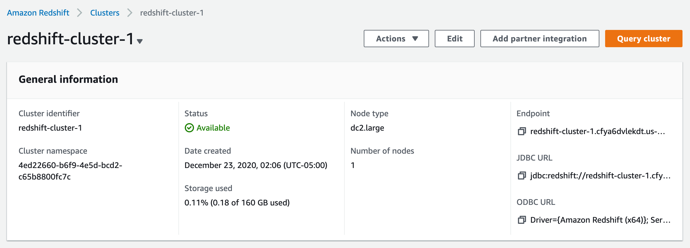
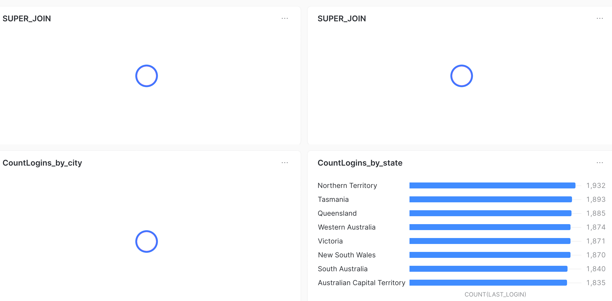

# redshift_snowflake_sample

# First Steps: Create an account on AWS & Snowlake plataforms

###

###

###

###

###

###

###

###

###

###

###

###

###

###

###

###

###

###

###

###

###

