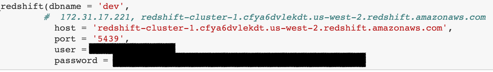
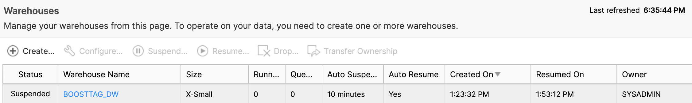

# redshift_snowflake_sample
### To begin with creating an account on AWS & Snowlake plataforms (Freemium)

### Initially, make a fake data-set

### After creating it, display all its items from DataFrame

### Subsequently, I show its information as to describe each feature/column

### Connect to redshift PaaS by their connection

### Set AWS Credential Keys

### The Data was split to 3 tables (citizens, address, health_care)

#### The redshift was built, and loaded with 3 dataFrames with an 'Unique code' in common

#### Update the tables to redshift

### Having uploaded the whole data to AWS Redshift, I connected to it, made queries, and joined to single table in order to data validation

### Make a default datawarehose on Snowflake plataform

### Using snowflake drivers in python, I create DATAWAREHOUSE, DATABASE and SCHEMA

### Pushing the 3 same frames from Redshift to Snowflake

### Testing correctly a query in SNOWFLAKE

### The result of the query

### View the snowflake's application
#### Create Worksheets

#### Build  Dashboards

### Loading Australian Dashboard using Worsheets

### BarCharts and LineCharts

### Scorecards

### HeatGrids

## Wrap up!
- Connect to RedShift(AWS) and Snowflake
- The fake-data consist of 100000 rows. Nonetheless, snowflake free has almost reached the limit of 1500 rows
- Handle with data with python
- Transform data, columns and dataframes into tables and dashboard on Snowflake
- Playing with Pandas: add rows, change dtypes of features, split and concat columns
- Create the charts of Snowflakes. Unfortunately, so far I don't know how to interactive a chart with each other 